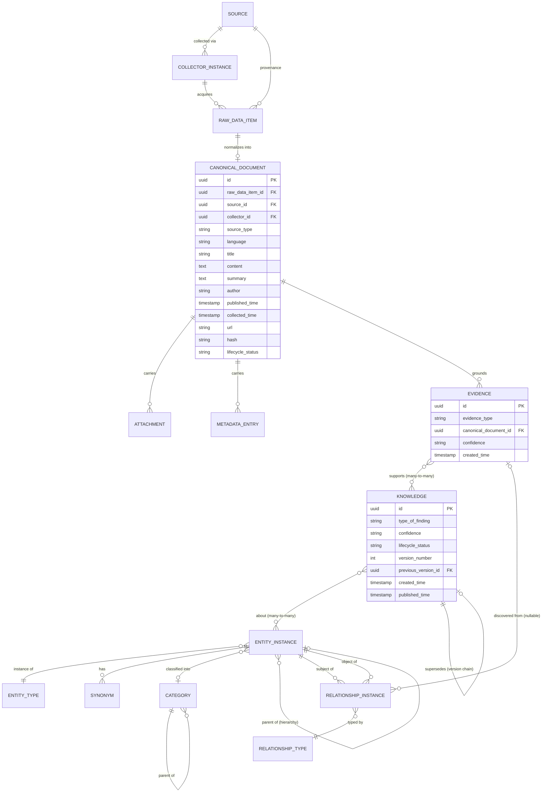

# Jade Intelligence Platform — Database Design

**Package:** T2 — Database Design
**Status:** Draft — Revision 1, awaiting Product Owner Review.
**Phase:** Technical Design only. No implementation, no code, no SQL migration were written for this document. This is the platform's own database design — entirely separate from `crm-thubinh`'s Supabase/PostgreSQL database (Platform Architecture Principle 1, Deployment §4 — the two systems' data stores are never shared or synchronized).

**Based on — Business Design (all 16, treated as LOCKED per this task's instruction; file headers stay "Draft," unedited, same convention established across every package of this platform):** `docs/JADE_INTELLIGENCE_PLATFORM.md` (1), `docs/CANONICAL_DATA_MODEL.md` (1.5), `docs/TAXONOMY_AND_ONTOLOGY.md` (1.6), `docs/EVIDENCE_AND_PROVENANCE_MODEL.md` (1.7), `docs/COLLECTOR_FRAMEWORK.md` (2), `docs/SOURCE_REGISTRY.md` (3), `docs/RAW_DATA_STORAGE.md` (4), `docs/PREPROCESSING_PIPELINE.md` (5A), `docs/UNDERSTANDING_PIPELINE.md` (5B), `docs/REASONING_PIPELINE.md` (5C), `docs/KNOWLEDGE_GENERATION_PIPELINE.md` (5D), `docs/KNOWLEDGE_GRAPH.md` (6), `docs/KNOWLEDGE_STORE.md` (7), `docs/CRM_INTEGRATION.md` (8), `docs/MONITORING.md` (9), `docs/DEPLOYMENT.md` (10). None of the sixteen is modified by this document.

**Based on — Technical Design:** "System Architecture (T1)" was named in this task as a LOCKED input. **Flagged, not silently resolved: no file named or resembling `SYSTEM_ARCHITECTURE.md` (or any "Package T1") exists anywhere in this repository** — checked `docs/` in full. This is the same gap this platform hit once before (Package 1.6 was instructed to continue from a "LOCKED Canonical Data Model" that didn't exist yet either), and the resolution then was the same one applied here: proceed without inventing the missing document's content, ground the work directly in what *does* exist and is actually LOCKED, and flag the gap explicitly rather than re-blocking a second time on the same question. Concretely, this Database Design is derived directly from the technical-shape implications already present in the 16 Business Design documents above — especially Platform Architecture §4–§13's layered pipeline and Core Components, Canonical Data Model's field-level shape, Evidence & Provenance Model's traceability chain, Raw Data Storage's storage principles, Knowledge Store's lifecycle, and Knowledge Graph's node/relationship model — none of which required a separate System Architecture document to already carry real database-design weight. See Open Question #1.

---

## 1. Database Design

### 1.1 Database Principles

Carried forward directly from the Business Design's own Design Principles, restated here as **database** principles specifically:

1. **Append-only where the business model says append-only.** Raw Data (Raw Data Storage §5) is never edited or overwritten in place — only ever inserted. The database design must make this the natural path, not merely a convention application code happens to follow.
2. **Nothing is silently overwritten anywhere traceability depends on it.** Canonical Documents, Evidence, and Knowledge (Knowledge Generation Pipeline §10, Knowledge Store §6) all evolve through retained history, never in-place mutation of a fact already relied upon by something downstream.
3. **Traceability must be a referential-integrity property, not a documentation promise.** The chain Knowledge → Evidence → Canonical Document → Raw Source → Collector → Collection Time (Evidence & Provenance Model §9) must be expressible as an unbroken, enforceable reference path in the schema — "no Knowledge item may exist without a complete path" (Evidence & Provenance Model §9) is a constraint the database should be able to guarantee, not just a rule the application layer promises to follow.
4. **One universal shape for Canonical Documents, regardless of source.** Canonical Data Model Design Principle 1 — every Collector's output lands in the same structure. Source-specific richness lives in Metadata (Canonical Data Model §6), never as a new column bolted on for one source type.
5. **Additive extensibility, not schema churn.** New Source Types, Collector Types, Evidence Types, Raw Data Types, and Entity Types are all explicitly "not closed" lists across the Business Design (Source Registry §5, Collector Framework §5, Evidence & Provenance Model §6, Raw Data Storage §6, Taxonomy & Ontology §4). The schema must accommodate a new type value without a migration that reshapes an existing table — type fields are open vocabularies, not fixed enums baked into the schema's structure.
6. **The platform's core is source-blind.** Canonical Data Model Design Principle 2 — Source, Source Type, and Collector are fields *on* a Canonical Document, never separate table structures or processing paths per source. The database mirrors this: one `canonical_document` shape, not one table per Source Type.
7. **Knowledge Generation is the only writer of Knowledge.** Knowledge Generation Pipeline Design Principle 1 — no Collector, Preprocessing, Understanding, or Reasoning stage may write to the tables that hold Knowledge. This is a write-ownership boundary the schema's access pattern should respect even though row-level enforcement is an implementation concern out of scope here.
8. **The Knowledge Graph is navigation, not a second store.** Knowledge Graph §9 explicitly resolves this: the graph is a way of querying relationships already present in the Evidence/Knowledge/Entity/Source data — it must not duplicate storage of anything those tables already hold (§1.4, §1.6 below).
9. **Fully independent of the CRM's database.** Platform Architecture Principle 1 and Deployment §4 — no foreign key, no shared schema, no shared connection ever crosses into `crm-thubinh`'s own Supabase database. Any future CRM Integration (Package 8) reads through an application-level surface, never a database-level join (Package 8 §3 — "Pull, not push," "no CRM write-back").
10. **Business-Design-first still applies to the schema itself.** Platform Architecture Principle 8 — this document proposes a data model; it does not create one. No table exists until this Database Design is approved.

---

### 1.2 Database Boundaries

**In scope — this database holds:**
- Source Registry data (Source Registry, Package 3).
- Collector Registry data (Collector Framework §6, Package 2).
- Raw Data (Raw Data Storage, Package 4) — content and its Provenance.
- Canonical Documents, Attachments, and Metadata (Canonical Data Model, Package 1.5).
- Taxonomy & Ontology reference data — Entity Types, Entity Instances, Categories, Synonyms, Relationship Types, Relationship Instances (Taxonomy & Ontology, Package 1.6).
- Evidence, including its links to Knowledge (Evidence & Provenance Model, Package 1.7).
- Knowledge, including its lifecycle and version history (Knowledge Generation Pipeline §9–§11, Knowledge Store, Packages 5D and 7).
- Monitoring data — Health Status, Business Metrics, Alerts, Audit Trail (Monitoring, Package 9).

**Out of scope — this database never holds:**
- Any CRM table, row, or schema element. The CRM Collector (Collector Framework §5) reads CRM data as a Source; what lands in this database is the resulting Canonical Document and Raw Data snapshot, never a live reference into the CRM's own database (Raw Data Storage §10's CRM Record example — "a point-in-time snapshot, not a live link").
- A second, duplicate representation of the Knowledge Graph's nodes/relationships — the graph is a query pattern over data already described in §1.5–§1.6, not an additional store (Knowledge Graph §9, Design Principle 1).
- Structured Understanding or Reasoning Output as durable, independently-queryable records in their own right, beyond what becomes Evidence (Evidence & Provenance Model §5's Evidence Chain) or a Knowledge Candidate (Knowledge Generation Pipeline §5). Understanding Pipeline §12 and Reasoning Pipeline §12 both describe their outputs as hand-offs to the *next* pipeline stage, not as a business object anything downstream is designed to query independently — modeling them as first-class stored tables would be scope this Business Design never asked for. See Open Question #2.
- Any AI model artifact, embedding, or vector representation — no AI vendor/approach is chosen anywhere in the Business Design (Platform Architecture §17 Open Question #3), so none is designed for here either. See Open Question #9.
- Deployment environment/infrastructure state (Deployment, Package 10) — that document is explicitly business governance, not a database concern, and stays out of scope here too.

---

### 1.3 Storage Layers

Mapping each Business Design layer to a storage responsibility:

| Storage Layer | Business Design Source | Holds |
|---|---|---|
| **Source Registry Store** | Source Registry (3) | Registered Sources and their Lifecycle/Attributes/Trust Level. |
| **Collector Registry Store** | Collector Framework §6 (2) | Collector instances, their configuration reference, and status. |
| **Raw Data Store** | Raw Data Storage (4) | Immutable, append-only raw content plus its Provenance. Large/binary-heavy by nature (§1.4). |
| **Canonical Document Store** | Canonical Data Model (1.5) | The normalized universal document shape, its Attachments, and its Metadata. |
| **Taxonomy & Ontology Store** | Taxonomy & Ontology (1.6) | Entity Types, Entity Instances, Categories, Synonyms, Relationship Types/Instances — low-churn reference/master data. |
| **Evidence Store** | Evidence & Provenance Model (1.7) | Evidence items and their links to the Canonical Documents they were drawn from and the Knowledge they support. |
| **Knowledge Store** | Knowledge Generation Pipeline §9–§11, Knowledge Store (5D, 7) | Knowledge items, their lifecycle status, and their full version history. |
| **Monitoring Store** | Monitoring (9) | Health Status observations, Business Metrics, Alerts, and the Audit Trail. |
| *(Knowledge Graph)* | Knowledge Graph (6) | **Not a separate storage layer** — a navigation/query pattern across the Evidence, Knowledge, Canonical Document, Raw Data, and Source layers above (§9 there; §1.4, §1.6 below). |
| *(CRM Integration)* | CRM Integration (8) | **No storage of its own** — an optional, read-only, one-directional external read surface in front of the Knowledge Store and Knowledge Graph query layer. No data physically moves into the CRM's database. |

---

### 1.4 Database Selection

No specific vendor, cloud provider, or product is chosen — Platform Architecture §16, Raw Data Storage §2.6, Knowledge Store §2.6, and Knowledge Graph §2.6 all explicitly keep storage technology-agnostic, and Platform ownership/hosting is still an open question (Platform Architecture §17 Open Question #8). What follows is a **paradigm-level recommendation** — the shape of the storage, not a product name — offered because "Database Selection" was explicitly requested as a deliverable of this package; the specific product is flagged as Open Question #3.

**Recommendation: two complementary storage paradigms, not one.**

1. **A relational database as the system of record** for every structured entity in §1.5 — Sources, Collectors, Canonical Documents (metadata, not large content), Taxonomy/Ontology reference data, Evidence, and Knowledge (including its version chain). Rationale:
   - Traceability (§1.1 Principle 3) is fundamentally a referential-integrity requirement — a relational database's foreign keys and constraints are the most direct way to make "no Knowledge item may exist without a complete path" enforceable rather than aspirational.
   - The data is overwhelmingly structured with clear, stable relationships (Evidence Chain, Ontology Relationships, Knowledge lifecycle) — exactly what a relational model is suited for.
   - Knowledge Store §5's five Organization concepts (by Entity, Category, Type of finding, Source lineage, Time) and §7's five Retrieval capabilities are all naturally expressed as relational queries/joins.

2. **A separate object/blob storage layer for large Raw Data content** — the actual bytes of HTML pages, PDFs, images, audio, and video (Raw Data Storage §6's Raw Data Types). Rationale:
   - Raw Data Storage §5 requires immutability and unbounded, indefinite-by-default retention (§9) — a pattern object storage is purpose-built for, and a poor fit for storing as large row values in a relational table.
   - Platform Architecture §13 notes Raw Data is expected to grow unbounded and that source volume varies wildly (an RSS item is small/frequent; a PDF report or video is large/infrequent) — decoupling bulk content from the relational system of record lets each scale on its own terms (§1.11).
   - The relational Raw Data record (§1.5) holds Provenance and a pointer to the object store, not the content itself — the same pattern already implied by Canonical Data Model §5's Attachments being "first-class... individually addressable."

**The Knowledge Graph does not get its own database in this recommendation.** Per Knowledge Graph §9's own resolution ("not a second place where facts live"), graph traversal (§1.6's Path/Context concepts) is implemented as recursive/relational queries over the Relationship Instance, Evidence, Knowledge, and Source tables already in the relational store. A dedicated graph database remains an option **later**, purely as a performance optimization if traversal query cost becomes a real bottleneck (§1.11) — not a decision this document makes now, since Knowledge Graph §12 Open Question left the question open and no traversal-scale data exists yet to justify it.

---

### 1.5 Data Model

Business-meaning entities from the Business Design, translated into record types with their key attributes. This is a conceptual data model — no column types, no SQL, no DDL.

| Record Type | Key Attributes | Business Source |
|---|---|---|
| **Source** | id, name, type, owner, language, region, status (lifecycle), trust_level, collection_method | Source Registry §3, §6 |
| **Collector Instance** | id, collector_type, source_id (→ Source), configuration reference, status, scheduling_approach | Collector Framework §4, §6, §7 |
| **Raw Data Item** | id, source_id (→ Source), collector_id (→ Collector Instance), raw_data_type, content pointer (object store), collected_time, lifecycle_status | Raw Data Storage §3, §4, §6 |
| **Canonical Document** | id, raw_data_item_id (→ Raw Data Item), source_id, source_type, collector_id, language, title, content, summary (nullable), author, published_time, collected_time, url, hash, lifecycle_status | Canonical Data Model §3, §4 |
| **Attachment** | id, canonical_document_id (→ Canonical Document), attachment_type, content pointer (object store) | Canonical Data Model §5 |
| **Metadata Entry** | canonical_document_id (→ Canonical Document), a flexible/open-ended key-value structure, owned by whichever Collector contributed it | Canonical Data Model §6 |
| **Entity Type** | id, name (Product, Material, Origin, Mine, Supplier, Market, Color, Transparency, Texture, Species, Treatment, Certificate, Laboratory, Customer, Company, Country, Province, Auction, Price Event, Trend, Event, Risk, Knowledge) | Taxonomy & Ontology §4 |
| **Entity Instance** | id, entity_type_id (→ Entity Type), canonical_name, category_id (nullable → Category), parent_instance_id (nullable, for Country→Province / Material→Species hierarchies) | Taxonomy & Ontology §4, §8 |
| **Synonym** | id, entity_instance_id (→ Entity Instance), label, language | Taxonomy & Ontology §6 |
| **Category** | id, name, parent_category_id (nullable, self-referencing) | Taxonomy & Ontology §5, §8 |
| **Relationship Type** | id, name (belongs to, made of, has, certified by, issued by, produces, located in, sells, operates in, owns, buys, offers, records price of, affects, derived from, impacts, associated with, about) | Taxonomy & Ontology §7 |
| **Relationship Instance** | id, subject_entity_instance_id, relationship_type_id, object_entity_instance_id, origin (Ontology-defined vs. Reasoning-discovered), evidence_id (nullable, for discovered relationships) | Taxonomy & Ontology §7, Reasoning Pipeline §7 |
| **Evidence** | id, evidence_type (Raw Document / Canonical Document / External Reference / Market Observation / Historical Knowledge / Future), canonical_document_id (nullable → Canonical Document, per type), confidence (business concept, no formula), created_time | Evidence & Provenance Model §3, §6, §7 |
| **Evidence–Knowledge Link** | evidence_id, knowledge_id (many-to-many — Evidence & Provenance Model Design Principle 3) | Evidence & Provenance Model §2, §10 |
| **Knowledge** | id, type_of_finding (Trend / Market Signal / Risk / Opportunity / Relationship / Future), confidence, lifecycle_status (Candidate/Published/Updated/Superseded/Archived), version_number, previous_version_id (nullable, self-referencing), created_time, published_time (nullable) | Knowledge Generation Pipeline §9–§11, Knowledge Store §3, §4 |
| **Knowledge–Entity Link** | knowledge_id, entity_instance_id (many-to-many — "Knowledge about any Entity Type") | Taxonomy & Ontology §7 |
| **Health Status Record** | scope_type, scope_id, status (Healthy/Warning/Degraded/Failed), observed_time | Monitoring §3, §4 |
| **Business Metric Record** | metric_type, value, period, recorded_time | Monitoring §5 |
| **Alert** | scope_type, scope_id, health_status, raised_time, resolved_time (nullable) | Monitoring §6 |
| **Audit Trail Entry** | event_type, scope_type, scope_id, detail, occurred_time | Monitoring §7 |

**Disclosed judgment call:** Metadata (Canonical Data Model §6) is modeled as a flexible/open-ended structure rather than fixed columns, specifically because §6 states Collectors "may contribute source-specific metadata without changing the Canonical Document" — a fixed-column design would violate Design Principle 5's additive extensibility the moment a new Collector needed a field no other Collector uses. The exact representation (a schema-less document field vs. a separate key-value table) is left as Open Question #4.

---

### 1.6 Entity Relationships

**Disclosed judgment call:** this diagram is a design notation (Mermaid ER syntax), not application code or SQL — used here because "Entity Relationships" was explicitly requested and a textual relationship table alone would understate the traceability chain's shape. Peripheral entities (Source Registry attributes, Collector configuration, Monitoring records) are omitted from the diagram for readability and are fully described in §1.5 instead.

The one-to-many arrow from **Raw Data Item → Canonical Document** encodes Raw Data Storage §7's stated assumption (one Raw Data item normalizes into exactly one Canonical Document) — flagged there as unconfirmed (Raw Data Storage §12 Open Question #1) and carried forward as Open Question #5 below, since it directly affects whether this relationship is truly one-to-one or should be one-to-many.

---

### 1.7 Index Strategy

Business-driven access patterns and why each needs fast lookup — no index syntax, no specific database's indexing mechanism chosen.

- **Canonical Document — by (source_id, source-provided identity)**: supports Canonical Data Model §7's Identity Rule that two documents from the same Source with the same source-provided identity are a re-collection, not a duplicate — this lookup is the first check Duplicate Detection (Preprocessing Pipeline §9) needs.
- **Canonical Document — by hash**: supports content-level duplicate recognition across different Sources (Canonical Data Model §7).
- **Canonical Document — by lifecycle_status and by collected_time/published_time**: supports Knowledge Store §5's "by time" organization and routine "what's newly Collected/Normalized and needs processing" pipeline queries.
- **Evidence — by canonical_document_id**: the most common traceability-chain lookup — "what Evidence was drawn from this document" (Evidence & Provenance Model §5).
- **Knowledge — by lifecycle_status**: supports the Candidate/Published/Superseded/Archived queries every consumer (Knowledge Store §7, Monitoring §3) needs — "what's currently Published" is the single most common Knowledge query.
- **Knowledge — by (entity_instance_id via Knowledge–Entity Link)**: supports Knowledge Store §7's "Find by Entity," the single most-named retrieval capability across the Business Design (also the basis of any future CRM Integration's Customer/Product use cases, CRM Integration §4).
- **Knowledge — by previous_version_id**: supports walking a Knowledge item's version chain (Knowledge Generation Pipeline §10, Knowledge Store §6).
- **Entity Instance — uniqueness on (entity_type_id, canonical_name)**: enforces Taxonomy & Ontology §9's Naming Rule that a canonical name is unique within its own Entity Type.
- **Synonym — by label**: the hot path for Entity Recognition (Understanding Pipeline §6) resolving a mentioned term back to its canonical concept — this needs to be fast since it runs on every processed document.
- **Relationship Instance — by subject_entity_instance_id and separately by object_entity_instance_id**: supports Knowledge Graph traversal (§6 there) in both directions — "what does this Entity connect to" and "what connects to this Entity."
- **Source — by lifecycle_status**: supports Monitoring §3's visibility into which Sources are Active/Paused, and routine "what's currently collectible" queries.
- **Audit Trail / Health Status / Metrics — by (scope_type, scope_id, observed_time / occurred_time)**: these are time-series-shaped by nature (Monitoring §5, §7) — recent-first retrieval per monitored scope is the dominant access pattern.

---

### 1.8 Partition Strategy

No specific partitioning mechanism is chosen (that is an implementation/technology decision), but the business shape of the data strongly suggests where partitioning will matter:

- **Raw Data is the primary candidate.** It is explicitly append-only and expected to grow unbounded (Raw Data Storage §5, §9; Platform Architecture §13) — a natural fit for time-based partitioning (e.g. by collected_time period), since queries skew heavily toward recent data while older partitions can eventually be moved to cheaper storage tiers once a retention policy exists.
- **Audit Trail is the second candidate**, for the same reason — Monitoring §7 describes it as an ever-growing operational record, and it is inherently time-series-shaped.
- **Canonical Documents and Evidence are plausible secondary candidates** once volume is known — time-based or source-type-based partitioning both align with Platform Architecture §13's observation that "source volume varies wildly by type" (an RSS feed is low-volume/high-frequency; a PDF report is high-volume/low-frequency).
- **Knowledge is not expected to need partitioning early.** Its volume is bounded by how much survives the full Knowledge Generation Pipeline (§9 there) — a much smaller, more curated set than Raw Data or Canonical Documents, at least at the platform's current, pre-launch scale.

**This entire strategy is provisional pending a retention policy.** Both Raw Data Storage §12 Open Question #3 and Knowledge Store §12 Open Question #7 leave retention/deletion undecided — partition boundaries are usually chosen *with* a retention/archival window in mind (e.g. "partition by month, drop partitions older than N years"), so a firmer partition design should wait for that policy rather than guessing at a window now. See Open Question #6.

---

### 1.9 Versioning Strategy

Direct database-design translation of Knowledge Generation Pipeline §10 and Knowledge Store §4/§6:

- **Knowledge never updates a row in place.** A new version is a new Knowledge record, linked to its predecessor via `previous_version_id` (§1.5). The predecessor's `lifecycle_status` moves to Superseded (Knowledge Store §4) — it is never deleted.
- **"Current" is a query, not a stored flag on old versions.** Finding the current Published version of a Knowledge item means finding the latest version in its chain whose status is Published — Superseded is a state on the *old* version, not a separate "is this current" boolean maintained by the application.
- **Evidence and Canonical Documents follow the same never-overwrite discipline**, though with an open question each: whether re-normalization of Raw Data ever updates an existing Canonical Document in place versus always creating a new one is explicitly unresolved upstream (Raw Data Storage §12 Open Question #2) — this design defaults to **append-a-new-record, never mutate**, for consistency with every other layer's discipline, but flags this default as a judgment call needing confirmation (Open Question #7).
- **Source attribute changes are a governance action, not a routine edit (Source Registry §9)** — since Trust Level or Owner changes can retroactively color how Evidence/Knowledge already derived from that Source is judged (Source Registry §12 Open Question #4, itself unresolved), this design flags that Source attribute changes likely need the same version-never-overwrite treatment as Knowledge, rather than a plain in-place update — not designed in full here (Open Question #8).
- **Taxonomy renames are explicitly high-stakes (Taxonomy & Ontology §9):** "renaming a canonical concept... can silently change the meaning of historical Trend and Knowledge data that already reference it." This implies Entity Instance canonical_name changes need their own audit/history trail, not a silent overwrite of the `canonical_name` column — flagged as a design detail this document raises but does not fully resolve (Open Question #8).

---

### 1.10 Backup Strategy

No backup tool, schedule, or vendor is chosen — Deployment (Package 10) explicitly keeps infrastructure out of scope, and this document follows the same boundary. What is captured here are the **business requirements** any future backup strategy must satisfy, drawn directly from Deployment §8's Business Continuity concepts:

- **Data integrity must survive an interruption (Deployment §8).** Raw Data's Immutability and Append-only principles (Raw Data Storage §5) must hold through any backup/restore cycle — a restore that loses or alters even one previously-Stored Raw Data item breaks a guarantee threaded through every downstream layer.
- **Knowledge integrity must survive an interruption (Deployment §8).** A restore must never result in a Knowledge item's version history being altered, collapsed, or made untraceable (Knowledge Store §6) — backup granularity needs to capture the full version chain, not just current-state snapshots.
- **Traceability must be restorable as a whole, not layer-by-layer.** Because the Evidence Chain spans Source → Raw Data → Canonical Document → Evidence → Knowledge, a backup/restore strategy that recovers these layers to inconsistent points in time (e.g. Knowledge restored to a later point than the Evidence it cites) would silently break Evidence & Provenance Model §9's Traceability Rules. Backups should be consistent across the whole traceability chain, not per-table.
- **The Audit Trail's own durability matters for incident review.** Monitoring §7's Audit Trail is the record of what the platform's machinery actually did — if it is lost in the same incident it would need to help diagnose, its value is defeated.

Actual backup frequency, retention window, and tooling are explicitly deferred as an implementation decision (Open Question #10) — consistent with Deployment §10's own out-of-scope boundary for infrastructure specifics.

---

### 1.11 Scalability

Grounded in Platform Architecture §13's Scalability principles, translated into database-design implications:

- **Each storage layer should scale independently**, mirroring Platform Architecture §13's "each layer scales independently" — decoupling Raw Data's object storage from the relational system of record (§1.4) is what makes this possible at the database level, not just the pipeline level.
- **Raw Data must handle unbounded growth (§1.8).** Choosing object/blob storage for bulk content, separate from the relational store, is what lets Raw Data's volume grow without degrading query performance on the much smaller, more actively-queried Canonical Document/Evidence/Knowledge tables.
- **Write throughput matters most for the pipeline stages, not for Knowledge.** Preprocessing, Understanding, and Reasoning (5A–5C) are described as needing independent scaling per stage (Platform Architecture §13) — the Canonical Document and Evidence tables need to sustain high insert/update volume from these stages, while the Knowledge table, being far smaller and more curated, has a lighter write load.
- **Relationship Instance is the one table with real combinatorial-growth risk.** Cross-document Analysis and Relationship Discovery (Reasoning Pipeline §6–§7) can, in principle, keep adding edges as more Evidence accumulates — if Knowledge Graph traversal query performance (§1.4, §1.6) becomes a bottleneck as this table grows, that is the concrete trigger for revisiting the "graph via relational joins" recommendation in §1.4 in favor of a dedicated graph database — not a decision to make preemptively now.
- **CRM Integration must never contend with the platform's own write path (CRM Integration §3, §6).** Because CRM reads are optional, read-only, and must never block the CRM if the Platform is slow or absent, any future CRM-facing read surface should be served from a read replica or similarly isolated read path, never from the same connections the AI pipeline writes through.
- **Source volume is non-uniform by design (Platform Architecture §13).** An RSS Collector and a PDF Collector produce very different write patterns from the same schema — the schema itself doesn't need to change per Source Type (§1.1 Principle 6), but capacity planning should assume uneven, bursty load rather than a steady average.

---

## 2. Open Questions

1. **System Architecture (T1) does not exist.** This task named it as a LOCKED input; no such document exists anywhere in the repository. This Database Design was produced directly from the Business Design's own technical-shape implications instead (see header). If a System Architecture document is produced later, it should be checked against this Database Design for consistency — the same reconciliation gap Taxonomy & Ontology §11 Open Question #3 already flagged for the (also-missing-at-the-time) Canonical Data Model.
2. **Should Structured Understanding or Reasoning Output ever be durably stored in their own right**, rather than only surviving as Evidence or a Knowledge Candidate? §1.2 assumes no, based on how Understanding Pipeline §12 and Reasoning Pipeline §12 describe their outputs as pipeline hand-offs — but if a future package (or Monitoring's own "Processing activity" metric, Monitoring §5) needs to inspect intermediate pipeline state after the fact for debugging, that would require designing storage for them after all. Not decided.
3. **Actual database product(s).** §1.4 recommends a relational-database-plus-object-storage paradigm but names no vendor, consistent with every prior package's technology-agnostic stance and Platform Architecture §17 Open Question #8 (ownership/hosting still undecided). Not decided.
4. **Metadata representation.** §1.5 flags Metadata as a flexible/open-ended structure but doesn't decide between a schema-less document field on Canonical Document versus a separate key-value table — a real design choice with different query/indexing trade-offs. Not decided.
5. **One-to-one vs. one-to-many, Raw Data Item → Canonical Document.** §1.6's diagram encodes the one-to-one assumption Raw Data Storage §7 itself flagged as unconfirmed (its own §12 Open Question #1) — e.g. one PDF Report containing several distinct articles might need to normalize into more than one Canonical Document. This directly changes whether that relationship is a foreign key on Canonical Document or a proper many-to-many link table. Not decided.
6. **Retention/partition window.** §1.8's partition strategy is explicitly provisional because no retention policy exists yet for Raw Data (Raw Data Storage §12 Open Question #3) or Knowledge (Knowledge Store §12 Open Question #7). Not decided.
7. **Does re-normalization create a new Canonical Document or update in place?** §1.9 defaults to "always append a new record" for consistency with the rest of the platform's versioning discipline, but Raw Data Storage §12 Open Question #2 leaves this genuinely open upstream — this document's default is a judgment call, not a resolution of that question.
8. **Do Source attribute changes and Entity Instance renames need their own version history**, the same way Knowledge does? §1.9 flags this as likely but does not design it — Source Registry §12 Open Question #4 (Trust Level change retroactivity) and Taxonomy & Ontology §9 (renaming as a "governed change") both point toward yes, but neither settles the mechanism. Not decided.
9. **Where would AI-model-adjacent data (embeddings, similarity scores for Duplicate Detection, classifier confidence internals) eventually live**, once an AI approach is chosen (Platform Architecture §17 Open Question #3)? Explicitly out of scope for this document (§1.2) since no AI vendor/technique is chosen anywhere in the Business Design — but flagged since it will eventually need a home, likely as an extension to the Evidence or Canonical Document records rather than a new core entity. Not decided.
10. **Backup frequency, retention window, and tooling.** §1.10 states only the business requirements a backup strategy must satisfy; the actual mechanics are deferred as an infrastructure/implementation decision, consistent with Deployment §10's own boundary. Not decided.

---

Technical Design only. No database created or modified. No SQL written. No implementation. Stopping — waiting for Product Owner Review.
