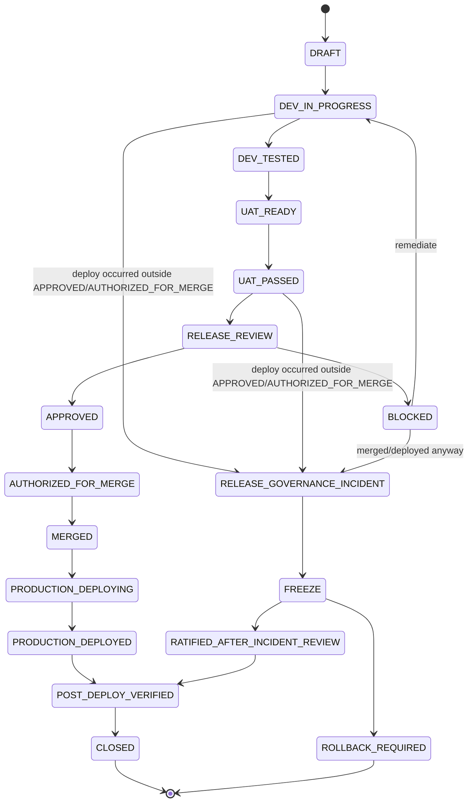

# Release State Machine

## States

```
DRAFT
  → DEV_IN_PROGRESS
  → DEV_TESTED
  → UAT_READY
  → UAT_PASSED
  → RELEASE_REVIEW
       → APPROVED
       → BLOCKED
```

If `APPROVED`:

```
APPROVED
  → AUTHORIZED_FOR_MERGE
  → MERGED
  → PRODUCTION_DEPLOYING
  → PRODUCTION_DEPLOYED
  → POST_DEPLOY_VERIFIED
  → CLOSED
```

If `BLOCKED`: the release returns to `DEV_IN_PROGRESS` (or `UAT_READY`, if the block was UAT-related, not code-related) for remediation, then re-enters `RELEASE_REVIEW` from the top. `BLOCKED` is not terminal — it's a return-to-sender, not a rejection of the feature.



## The controlling rule

**If a deployment happens from any state other than `APPROVED` / `AUTHORIZED_FOR_MERGE`, that is a `RELEASE_GOVERNANCE_INCIDENT` — full stop.** This includes deployment from `BLOCKED`, from a local-only branch never in this state machine at all, or from any state where the last recorded Release Control decision was not `APPROVED` for that exact release.

`RATIFIED_AFTER_INCIDENT_REVIEW` is **not** a normal release path and must never be treated as one. It is the outcome of the incident procedure (`INCIDENT_PROCEDURE.md`) when read-only evidence shows the deployed content is, after the fact, correct and safe to leave in place. It always implies a `RELEASE_GOVERNANCE_INCIDENT` occurred — a release that goes `APPROVED → ... → CLOSED` cleanly never touches this state. If any release plan expects to end at `RATIFIED_AFTER_INCIDENT_REVIEW`, that plan is wrong before it starts.

## State definitions

| State | Meaning | Who moves it forward |
|---|---|---|
| `DRAFT` | Feature/fix scoped, not yet started | Development |
| `DEV_IN_PROGRESS` | Implementation underway | Development |
| `DEV_TESTED` | Unit/integration tests pass locally/in Dev | Development |
| `UAT_READY` | Deployed to Dev in a UAT-able state | Development |
| `UAT_PASSED` | Product Owner has accepted the feature against Dev | Product Owner |
| `RELEASE_REVIEW` | Evidence package submitted, awaiting a decision | Development submits; 🚦 Release Control decides |
| `APPROVED` | 🚦 Release Control has cleared this exact SHA for merge | 🚦 Release Control |
| `BLOCKED` | 🚦 Release Control has explicitly refused; not a maybe | 🚦 Release Control |
| `AUTHORIZED_FOR_MERGE` | The specific, narrow window in which a merge into `main` may occur | 🚦 Release Control's `APPROVED` opens this window |
| `MERGED` | The approved content is now in `main`'s history | GitHub (merge action) |
| `PRODUCTION_DEPLOYING` | Vercel's GitHub integration has picked up the `main` change | Vercel (automatic) |
| `PRODUCTION_DEPLOYED` | Vercel reports the deployment `READY`/`success` | Vercel (automatic) |
| `POST_DEPLOY_VERIFIED` | Identity + content + DB + smoke evidence collected per `POST_DEPLOY_VERIFICATION.md` | Development collects; 🚦 Release Control reviews |
| `CLOSED` | Release lifecycle complete | 🚦 Release Control |
| `RELEASE_GOVERNANCE_INCIDENT` | The hard stop was violated | Detected by anyone; see `INCIDENT_PROCEDURE.md` |
| `FREEZE` | No further deploy/merge/rollback until Release Control decides | Automatic on incident detection |
| `RATIFIED_AFTER_INCIDENT_REVIEW` | Exceptional: incident's deployed content verified correct and safe, left in place | 🚦 Release Control only, after full read-only incident verification |
| `ROLLBACK_REQUIRED` | Exceptional: incident verification found a real discrepancy | 🚦 Release Control only |

## No release is `CLOSED` until `POST_DEPLOY_VERIFIED`

A `PRODUCTION_DEPLOYED` release that never collects post-deploy evidence is not done — it's an open liability. `CLOSED` requires the full `POST_DEPLOY_VERIFICATION.md` package, reviewed by Release Control, same as the pre-deploy package.
